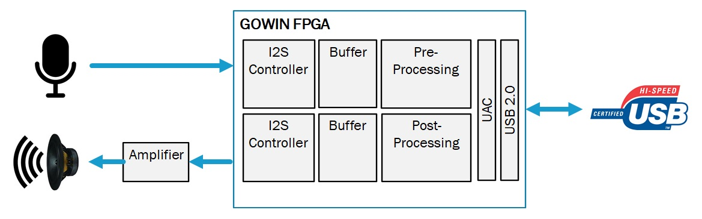

# USB Audio Class to I2S Audio Card Reference Design

## Introduction
The GOWIN UAC (USB Audio Class) to I2S Audio Card Reference Design provides an example of using various IPs to play and record Audio from a PC using GOWIN FPGAs.  The reference design connects GOWIN Semiconductors USB 2.0 PHY, Device Controller, I2S RX and TX IP Cores as well as provides some basic control logic via USB HID (Human Interface Device).  This provides a starting point to develop custom USB Audio solutions on GOWIN FPGAs.

## Key Features
- Supports USB 2.0 PHY and Device Controller
- Uses I2S for audio inputs and outputs
- Provides loopback mode connecting I2S output to I2S input for comparison tests
- Compatible with native USB Audio Class drivers on Windows, Linux and MAC OS
- Initializes as a 'GOWIN UAC' USB Audio Card
- Plays audio from PC through speaker
- Records audio to PC through microphone

## Top Level Port List

| Port            | Direction | Pin Number | Description |
| --------------- | --------- | ----------- | ----------- |
| ***Parameters***                      |           |             |             |
| p_loopback                            | - | - | 1=I2S Loopback, 0= Mic Input |
| ***Input Clocks*** |           |             |             |
| CLK_IN   | Input | 10 | 12Mhz (USB) |
| CLK_IIS_I    | Input | 35 | 8.192Mhz (Audio) |
| ***I2S Output to Amplifier/Speaker*** |           |             |             |
| IIS_LRCK_O   | Output | 81 | I2S LRCLK to Amplifier |
| IIS_BCLK_O   | Output | 83 | I2S BCLK to Amplifier |
| IIS_DATA_O   | Output | 82 | I2S Data to Amplifier |
| ***I2S Output to Amplifier/Speaker*** |           |             |             |
| IIS_LRCK_I   | Output | 84 | I2S LRCLK to Microphone |
| IIS_BCLK_I   | Output | 85 | I2S BCLK to Microphone |
| IIS_DATA_I   | Input | 86 | I2S Data to Microphone |
| ***USB 2.0 Interface*** |           |             |             |
| usb_vbus     | Input | 31 | USB VBUS Monitor |
| usb_dxp_io   | Input/Output | 73 | USB IO Data |
| usb_dxn_io   | Input/Output | 72 | USB IO Data |
| usb_rxdp_i   | Input | 77 | USB IO Monitor |
| usb_rxdn_i   | Input | 71 | USB IO Monitor |
| usb_pullup_en_o | Output | 80 | USB 1.5k Pull Up Control |
| usb_term_dp_io | Input/Output | 75 | USB Termination Control |
| usb_term_dn_io | Input/Output | 74 | USB Termination Control |

## FPGA Project

The GOWIN FPGA project targets the GOWIN GW2AR-18 FPGA device and the GOWIN DK_USB2.0.  This provides a vast amount of resources for design expansion and debug.  Please note that the GOWIN USB 2.0 PHY IP requires a C8/I7 speed grade.  However,

###### How to Open FPGA Project

1. Ensure latest version of GOWIN EDA is installed and an active license is setup
2. Open GOWIN EDA
3. File --> Open --> Navigate to 'usbAudio.gprj'

The reference design is written in Verilog HDL.  Pin constraints for the GOWIN DK_USB2.0 Development Board are setup in the usb2Audio.cst and timing constraints for the various clock domains is provided in usb2Audio.sdc.  The below table describes each Verilog file in the design and its function in the design.

| Verilog Design File Name | Module Name               | Description                             |
| ------------------------ | ------------------------- | --------------------------------------- |
| top.v                    | top                       | Top Level Design                        |
| gowin_rPLL.v             | Gowin_rPLL                | USB Clock Domain PLL (480Mhz and 60mhz) |
| iis_rpll.v               | iis_rPLL                  | I2S Clock Domain PLL (98.304Mhz)        |
| i2s_audio_tx.vp          | i2s_audio_tx              | I2S TX Module to Amplifier              |
| i2s_audio_rx.vp          | i2s_audio_rx              | I2S RX Module to Amplifier              |
| sync_pkt_fifo.v          | sync_pkt_fifo             | FIFO for I2S RX Input                   |
| usb2_0_softphy.v         | USB2_0_SoftPHY_Top        | USB 2.0 PHY                             |
| usb_device_controller.v  | USB_Device_Controller_Top | USB 1.1/2.0 Device Controller           |
| usb_descriptor_iis.v     | usb_desc                  | USB Device Descriptor Initialization    |

| Constraint file | Description                      |
| --------------- | -------------------------------- |
| usb2Audio.cst   | Pin Constraint File              |
| usb2Audio.sdc   | Clock and Timing Constraint File |

## Resource Utilization

The UAC to I2S Audio Card Reference Design is optimized for low density FPGAs and can fit in both LittleBee and Aurora FPGA product families.  The design is under 5K LUTs making it the ideal choice for developing a variety of different USB audio products.

| Resource Type | Resource Count |
| ------------- | -------------- |
| LUT           | 4558           |
| REG           | 1575           |
| PLL           | 2              |
| BSRAM         | 7              |

## Fabric Clocks FMAX
| Clock      | Operating Frequency (Mhz) | Maximum Frequency (Mhz) | Description      |
| ---------- | ------------------------- | ----------------------- | ---------------- |
| CLK_IN     | 12                        | 83.3                    | USB Input        |
| I2S_FCLK   | 98.304                    | 115.5                   | Audio System     |
| USB_FCLK   | 480                       | NA                      | USB Serializer   |
| USB_PCLK   | 60                        | 74.2                    | USB UTMI System  |
| USB_CLKDIV | 120                       | 175.5                   | USB PHY Internal |
| CLK_IIS_I  | 8.192                     | NA                      | Audio Input      |

## Demo Setup
The USB2I2S is implemented on a GOWIN FPGA along with the USB 2.0 PHY device controller and a UAC link layer to take audio data from a USB host such as a personal computer and send that data to the USB device. We use GOWIN FPGA to convert it to an audio interface i2s and drive it by an external amplifier which is then passed to the speaker.

#### Demonstration Setup:  GOWIN DK-USB2.0 + GOWIN EVAL_AUDIO Board

The USB audio class demo utilizes two boards. First board is a DK USB 2.0 development board. This is connected to the USB host (in this case personal computer) using a USB cable and a USB port on this board. This board also contains the FPGA which will contain the USB 2.0 device controller and UAC link layer. This board has a GPIO header which is used for ground between the two headers. There is an i2s clock and an i2s data line. These lines are connected with flyer wires to the second board which is audio amplifier board. This board has its own header on. It also contains audio amplifier as well as a 1/8 inch audio output jack.

######  ⚠*We are in the process of replacing the GOWIN EVAL-AUDIO Board with readily available MAX98357A Amplifier and SPH0645LM4H I2S Microphone modules.  More instructions to follow, but here is the expected component list*.
1. GOWIN DK-USB Board 2. MAX98357A Amplifier Module

2. SPH0645LM4H I2S Microphone module

3. Small 4 ohm speaker (or cheap headphones and cut off jack) 

4. Connectivity between boards

QTY 10 - Dupont Flywires

***OR***

1x7 female 0.1" header (Amplifier) & 1x6 female 0.1" header (Microphone)

*We have tested using the MAX98357A I2S Amplifier Module and SPH0645LM microphone module with the current design.*.⚠

### Demonstration Setup - GOWIN DK-USB2.0 + MAX98357A I2S Amplifier & SPH0645LM4H Microphone Boards

