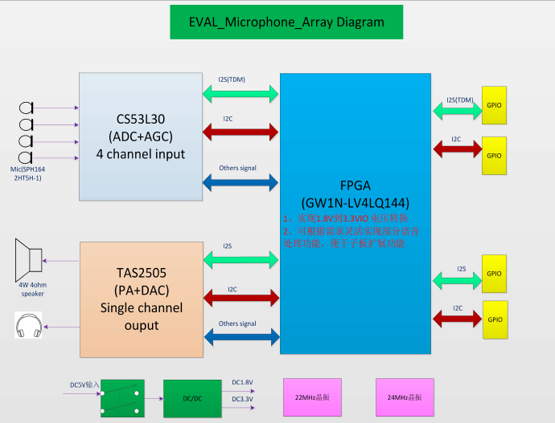

# USB To/From I2S

### This design is still in the process of cleaned up and documentation write up.  Please use for your reference purpose appropriately.

### We are in the process of replacing the GOWIN EVAL-AUDIO Board with readily available I2S amplifier and microphone modules.  More instructions to follow, but here is the expected component list

1. GOWIN DK-USB Board

2. MAX98357A Amplifier Module

3. SPH0645LM4H I2S Microphone module

4. Small 4 ohm speaker (or cheap headphones and cut off jack) 

5. Connectivity between boards

   1. QTY 10 - Dupont Flywires

      ​	***OR***

   2. 1x7 female 0.1" header (Amplifier) & 1x6 female 0.1" header (Microphone)
##

### Current Demonstration Setup with GOWIN DK-USB2.0 + GOWIN EVAL_AUDIO Boards

