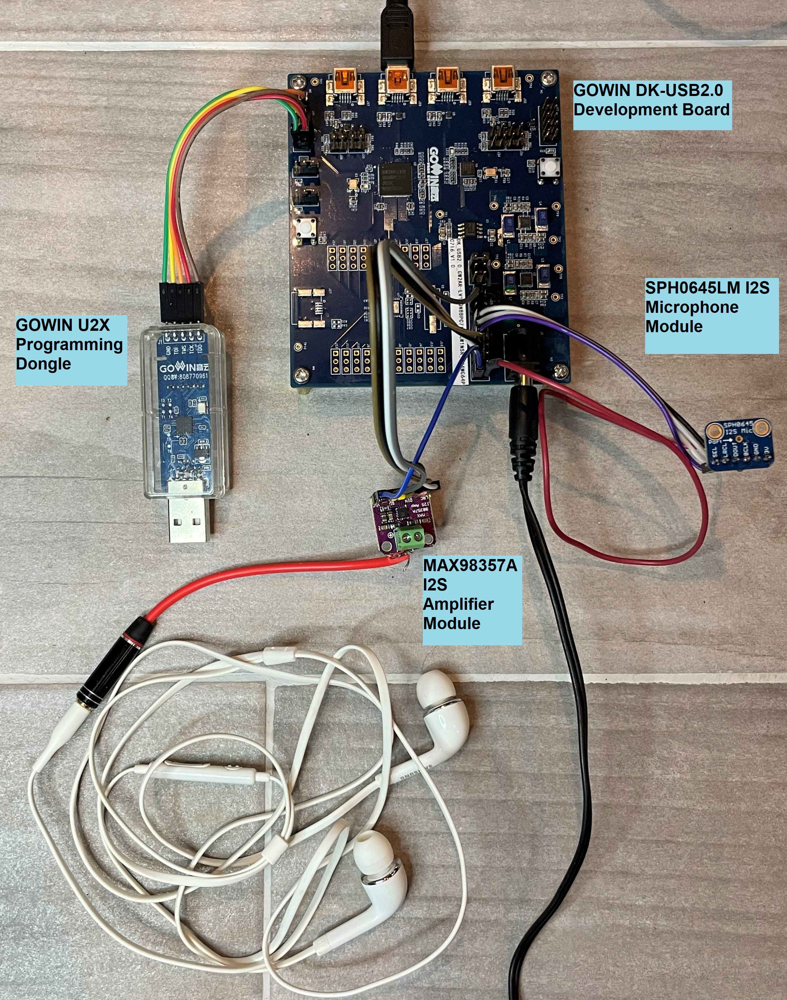

# UAC (USB Audio Class) to I2S Audio Card Reference Design

## Introduction
The USB Audio Class to I2S Audio Card Reference Design provides an example of using various IPs to play and record Audio from a PC using GOWIN FPGAs.  The reference design connects GOWIN Semiconductors USB 2.0 PHY, Device Controller, I2S RX and TX IP Cores as well as provides some basic control logic via USB HID (Human Interface Device).  This provides a starting point to develop custom USB Audio solutions on GOWIN FPGAs.

## Key Features
- Supports USB 2.0 PHY and Device Controller
- Uses I2S for audio inputs and outputs
- Compatible with native USB Audio Class drivers on Windows, Linux and MAC OS
- Initializes as a 'GOWIN UAC' USB Audio Card
- Plays audio from PC through speaker
- Records audio to PC through microphone

## Top Level Port List
| Port            | Direction | Description |
| --------------- | --------- | ----------- |
| ***Input Clocks*** |           |             |
| CLK_IN   | Input | 12Mhz (USB) |
| CLK_IIS_I    | Input | 8.192Mhz (Audio) |
| ***I2S Output to Amplifier and Speakers*** |           |             |
| IIS_LRCK_O   | Output | I2S LRCLK to Amplifier |
| IIS_BCLK_O   | Output | I2S BCLK to Amplifier |
| IIS_DATA_O   | Output | I2S Data to Amplifier |
| ***I2S Output to Amplifier and Speakers*** |           |             |
| IIS_LRCK_I   | Output | I2S LRCLK to Microphone |
| IIS_BCLK_I   | Output | I2S BCLK to Microphone |
| IIS_DATA_I   | Input | I2S Data to Microphone |
| ***USB 2.0 Interface*** |           |             |
| usb_vbus     | Input | USB VBUS Monitor |
| usb_dxp_io   | Input/Output | USB IO Data |
| usb_dxn_io   | Input/Output | USB IO Data |
| usb_rxdp_i   | Input | USB IO Monitor |
| usb_rxdn_i   | Input | USB IO Monitor |
| usb_pullup_en_o | Output | USB 1.5k Pull Up Control |
| usb_term_dp_io | Input/Output | USB Termination Control |
| usb_term_dn_io | Input/Output | USB Termination Control |

## FPGA Project
Briefly describe the FPGA project and show project directory and Verilog file structure

## Resource Utilization
Review resource utilization report
Make a table to key resources in the design (LUT, REG, DSP, PLL, BSRAM)

## Fabric Clocks FMAX
Review the timing report of the design, clean up any timing errors or issues with asynchronous signals like reset, etc
Put major fpga design clocks in a table with the maximum speed they can run at
Note the speed grade of the device used for these timing numbers

## Demo Setup
### We are in the process of replacing the GOWIN EVAL-AUDIO Board with readily available I2S amplifier and microphone modules.  More instructions to follow, but here is the expected component list

1. GOWIN DK-USB Board

2. MAX98357A Amplifier Module

3. SPH0645LM4H I2S Microphone module

4. Small 4 ohm speaker (or cheap headphones and cut off jack) 

5. Connectivity between boards

   1. QTY 10 - Dupont Flywires

      ​	***OR***

   2. 1x7 female 0.1" header (Amplifier) & 1x6 female 0.1" header (Microphone)
##

### Current Demonstration Setup with GOWIN DK-USB2.0 + MAX98357A I2S Amplifier Boards

### Current Demonstration Setup with GOWIN DK-USB2.0 + GOWIN EVAL_AUDIO Boards

